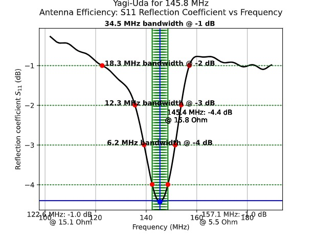

# Antena Yagi-Uda para a faixa dos 2 metros

Nesta prática, vamos projetar e simular uma antena Yagi-Uda para a faixa de 2 metros do serviço radioamador.

Em particular, nosso objetivo é otimizar a antena para 145.825 MHz, a frequência utilizada para [APRS na ISS](https://www.aprs.org/iss-faq.html).

Este repositório contém os códigos base necessários para simular a antena com o [OpenEMS](https://openems.io), mas se você preferir, pode usar outros simuladores, como alguma variante do [NEC](https://en.wikipedia.org/wiki/Numerical_Electromagnetics_Code) ou o [FEKO](https://altair.com/feko).

## Dependências

No Arch Linux, utilize os pacotes a seguir obtidos do [AUR](https://aur.archlinux.org) ou precompilados do [Chaotic AUR](https://aur.chaotic.cx):


```bash
sudo pacman -S openmpi openems-git csxcad-git qcsxcad-git appcsxcad-git python-openems-git python-csxcad-git python-matplotlib
```

Se você usa outra distribuição, prefixe todos os comandos descritos neste documento com `./run-docker` para executá-los dentro de um container.

## Explicação dos parâmetros

### Configurações de simulação

Todos os códigos de simulação deste repositório contém os seguintes três parâmetros:

* `enable_appcsxcad`: Abre uma janela com o modelo 3D da antena antes de iniciar a simulação. Mantenha desativado caso você tenha problemas com uso de interface gráfica no Docker. Mesmo quando o modelo 3D não é mostrado na tela, ele é gravado em XML no diretório [models](models). 

* `enable_show_plots`: Abre em janelas os gráficos gerados pelo script. Mantenha desativado caso você tenha problemas com uso de interface gráfica no Docker. Mesmo quando os gráficos não são mostrados na tela, eles são gravados em formato SVG no diretório [results](results). 

* `enable_nf2ff`: Ativa a simulação de campo distante. Recomendamos ativar somente quando você estiver fazendo estudos de direcionalidade, pois esta opção deixa a simulação mais lenta.

## Parâmetros de geometria da antena

O arquivo [yagi_trena.py](yagi_trena.py) contém o código necessário para simular uma antena Yagi-Uda.

Os parâmetros geométricos são ilustrados nas figuras a seguir.


Caso `hairpin_enable` seja ativado, o script insere um [hairpin](https://smarc.org.au/wp-content/uploads/2021/11/Hairpin-Matching-VK2DEQ.pdf) com os parâmetros geométricos a seguir.


Caso necessário, sinta-se livre para editar o script e modificar o código que desenha o modelo, mas atente-se para a saída do OpenEMS. Se a mensagem `Warning: Unused primitive (type: XXX) detected in property: YYY!` aparecer, significa que você precisa editar também o *mesh* para incluir pelo menos uma linha passando pela figura geométrica que você adicionou ao modelo.


## Roteiro

Como as simulações com o OpenEMS exigem muito processamento e são demoradas (da ordem de 10 minutos em um laptop típico), **esta prática não tem correção automática**.

Clone este repositório, faça as modificações necessárias em [yagi_trena.py](yagi_trena.py), se precisar adicione novos arquivos, e **edite este README.md** respondendo às perguntas abaixo.

Inclua screenshots e gráficos gerados pelo simulador para ilustrar e justificar suas respostas.

### Ressonância

* Você consegue ajustar os parâmetros geométricos da sua antena para que a ressonância ocorra em 145.825 MHz?

Sim, foi possível ajustar os parâmetros geométricos da antena para que a ressonância ocorresse bem próximo da frequência alvo. O processo iterativo de ajuste dos atributos levou a uma ressonância em 145.4 MHz, um resultado satisfatório para a prova de conceito do projeto.

Dessa forma, foram alterados os seguintes parâmetros:
```
director_length = 864
director_dist = 263
reflector_length = 951
reflector_dist = 311
```


*Resultado da compilação do yagi_trena.py*

* Qual a banda da sua antena? Como ela se compara com a banda de uma antena dipolo ([dipole.py](dipole.py) ou [dipole_trena.py](dipole_trena.py))? O que seria necessário para que a banda da sua antena fosse mais estreita em torno de 145.825 MHz?

A banda passante de uma antena é comumente definida como a faixa de frequências onde o coeficiente de reflexão (S11) é inferior a -10 dB.

Para a nossa antena Yagi-Uda (ainda sem o casamento de impedância), o S11 não atinge o patamar de -10 dB. No entanto, sua largura de banda para S11 < -4 dB é de 6.2 MHz. Em comparação, a antena dipolo de referência apresentou uma largura de banda de 27.0 MHz para S11 < -10 dB.

A comparação direta dos dados comprova que a antena Yagi-Uda é uma antena de banda inerentemente mais estreita que a dipolo. A adição de elementos parasitas (refletor e diretor) aumenta a seletividade de frequência da antena (aumenta o "Fator Q"), o que resulta em maior ganho e diretividade, ao custo de uma menor largura de banda operacional.



*Gráfico de reflexão yagi_trena.py*

### Impedância

* Você consegue casar a impedância da sua antena com a impedância do transceptor de rádio (50 ohms, puramente reais), mantendo-a em ressonância na frequência desejada? A abordagem sugerida é ativar `hairpin_enable` e usar um [hairpin](https://smarc.org.au/wp-content/uploads/2021/11/Hairpin-Matching-VK2DEQ.pdf) para fazer o casamento.

Sim. Após a sintonia inicial, a antena apresentou uma impedância de 15.8 Ω. Para corrigir essa incompatibilidade, parâmetros de hairpin foram alterados experimentalmente para obter melhores resultados. Com os parâmetros `hairpin_enable = True` e `hairpin_length = 58`, foi possível transformar a baixa impedância da antena para 54.1 Ω, mantendo a ressonância em 145.8 MHz.


*Grafíco de reflexão yagi_trena.py*

### Direcionalidade

* Você consegue comprovar que a antena Yagi-Uda é direcional?

   Dica: Compare com a saída de algum dos simuladores de antena dipolo ([dipole.py](dipole.py) ou [dipole_trena.py](dipole_trena.py)).

Sim. A comprovação é feita pela análise comparativa dos diagramas de irradiação da antena Yagi-Uda e de uma antena Dipolo.
Primeiro, o diagrama de irradiação da antena Dipolo de referência exibe um padrão clássico e simétrico, com dois lobos de irradiação de mesma intensidade. Isso caracteriza uma antena bidirecional, que irradia energia igualmente para frente e para trás.


*Diagrama de irradiação da antena Dipolo de referência. Note o padrão simétrico com dois lobos de igual intensidade.*

Em contraste, o diagrama da antena Yagi-Uda é marcadamente assimétrico. Ele apresenta um lobo principal dominante, que concentra a maior parte da energia em uma única direção, e um lobo traseiro significativamente menor. Essa capacidade de focar a energia irradiada em um feixe principal é a definição de uma antena direcional.


*Diagrama de irradiação da antena Yagi-Uda final. O lobo principal único comprova sua natureza direcional.*

* Você consegue comprovar que a sua Yagi-Uda irradia mais na direção do elemento *director* que na direção do elemento *reflector*, ou seja, que a sua antena não está invertida?

Sim. No modelo da simulação, o elemento diretor foi posicionado na direção correspondente a `theta = -90°`, enquanto o refletor foi posicionado em `theta = +90°`.

Ao analisar o diagrama de irradiação da Yagi, observamos que o lóbulo de maior ganho (o lóbulo principal) está centrado em `theta = -90°`. O ganho na direção oposta (lobo traseiro, `theta = +90°`) é visivelmente menor. Isso comprova que a antena irradia primariamente para a frente, na direção do elemento diretor, e que não está invertida. A diferença entre esses ganhos é conhecida como relação frente-costas (front-to-back ratio).

* Você consegue melhorar a direcionalidade (e consequentemente, o ganho) da sua Yagi-Uda modificando os parâmetros geométricos (mantendo-a em ressonância e com a impedância casada em 50 ohms na frequência desejada)?

Sim. Embora a antena de 3 elementos já seja direcional, seu ganho pode ser melhorado. A forma mais eficaz de aumentar a diretividade de uma Yagi-Uda é através da adição de mais elementos diretores e da otimização do espaçamento entre todos os elementos.

Por exemplo, evoluir o projeto para uma antena de 4 ou 5 elementos, e ajustar os espaçamentos para otimizar a fase dos sinais acoplados, resultaria em um lóbulo principal mais estreito e com maior ganho. No entanto, é crucial notar que cada modificação geométrica exige um novo ciclo de sintonia de ressonância (ajuste do `driven_length`) e de casamento de impedância (ajuste do `hairpin`), demonstrando a natureza iterativa do projeto de antenas.